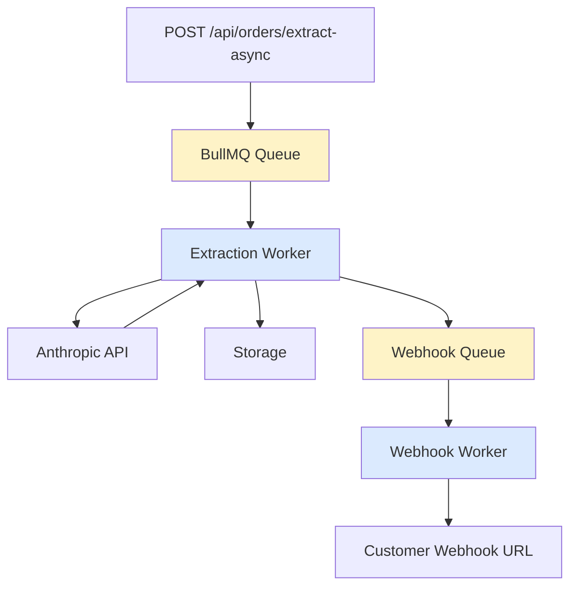

## Overview

Chat2Cash uses **BullMQ** (Redis-backed job queue) to handle long-running order extractions asynchronously. This prevents API timeouts and enables webhook-based result delivery.

## Architecture



### Components

<CardGroup cols={2}>
  <Card title="Extraction Queue" icon="inbox">
    Processes order extraction jobs (concurrency: 3, rate: 10/min)
  </Card>
  <Card title="Webhook Queue" icon="bell">
    Delivers job results via HTTP POST (concurrency: 5, retries: 10)
  </Card>
  <Card title="Extraction Worker" icon="gears">
    Calls Anthropic API and saves orders to storage
  </Card>
  <Card title="Webhook Worker" icon="paper-plane">
    POSTs job status to customer-provided URLs
  </Card>
</CardGroup>

## Queue Configuration

### Redis Connection

BullMQ requires a dedicated Redis connection with `maxRetriesPerRequest: null`:

```typescript
import { Queue, Worker } from "bullmq";
import IORedis from "ioredis";
import { env } from "../config/env";

/**
 * BullMQ requires its own dedicated IORedis connection with
 * maxRetriesPerRequest: null — it must NOT share the instance in
 * src/config/redis.ts which uses maxRetriesPerRequest: 3.
 */
const connection = new IORedis(env.REDIS_URL, {
  maxRetriesPerRequest: null,
});

connection.on("error", (err) => {
  logger.error({ err }, "BullMQ Redis connection error");
});

connection.on("connect", () => {
  logger.info("BullMQ Redis connected for job queue");
});
```

<Warning>
  Do NOT reuse the Redis client from `src/config/redis.ts`. BullMQ requires `maxRetriesPerRequest: null` to handle long-running blocking commands.
</Warning>

*Source: backend/src/services/queueService.ts:11-26*

### Extraction Queue

Handles order extraction jobs with retry and cleanup policies:

```typescript
export const extractionQueue = new Queue("order-extraction", {
  connection,
  defaultJobOptions: {
    attempts: 3,
    backoff: { type: "exponential", delay: 3000 },
    removeOnComplete: { age: 3600 * 24 },  // Keep for 24 hours
    removeOnFail: false,                    // Keep failed jobs (DLQ)
  },
});
```

**Configuration:**
- **3 attempts** — Max retries before job moves to Dead Letter Queue (DLQ)
- **Exponential backoff** — 3s → 6s → 12s between retries
- **24-hour retention** — Completed jobs auto-deleted after 24 hours
- **Failed jobs persist** — Allows manual retry via DLQ management

*Source: backend/src/services/queueService.ts:29-37*

### Webhook Queue

Delivers job results to customer-provided webhook URLs:

```typescript
export const webhookQueue = new Queue("webhook-delivery", {
  connection,
  defaultJobOptions: {
    attempts: 10,
    backoff: { type: "exponential", delay: 5000 },
    removeOnComplete: { age: 3600 * 24 },
    removeOnFail: { age: 3600 * 72 },       // Keep for 3 days
  },
});
```

**Configuration:**
- **10 attempts** — Aggressive retry for webhook delivery
- **5s initial delay** — 5s → 10s → 20s → ... (capped at 10 minutes)
- **72-hour DLQ retention** — Failed webhooks kept for 3 days

*Source: backend/src/services/queueService.ts:39-47*

## Job Types

### ExtractionJobData

```typescript
export interface ExtractionJobData {
  type: "single_message" | "chat_log";
  orgId: string;
  correlationId?: string;
  message?: string;               // For "single_message" type
  messages?: ChatMessage[];       // For "chat_log" type
  webhookUrl?: string;            // Optional result delivery URL
}

export interface ExtractionJobResult {
  orderId: string;
  status: "completed" | "failed";
  error?: string;
}
```

*Source: backend/src/services/queueService.ts:50-63*

### WebhookJobData

```typescript
export interface WebhookJobData {
  webhookUrl: string;
  payload: Record<string, unknown>;
  correlationId?: string;
}
```

*Source: backend/src/services/queueService.ts:65-69*

## Workers

### Extraction Worker

Processes order extraction jobs in the background:

```typescript
export function startExtractionWorker(): Worker {
  worker = new Worker<ExtractionJobData, ExtractionJobResult>(
    "order-extraction",
    async (job: Job<ExtractionJobData, ExtractionJobResult>) => {
      const cid = job.data.correlationId ?? job.id;
      logger.info({ jobId: job.id, type: job.data.type, correlationId: cid }, "Processing extraction job");

      await job.updateProgress(10);

      let savedOrder;
      const { orgId } = job.data;
      if (!orgId) throw new Error("Invalid job data: missing orgId");

      if (job.data.type === "single_message" && job.data.message) {
        const order = await anthropicService.extractOrderFromMessage(job.data.message);
        await job.updateProgress(70);
        savedOrder = await storage.addOrder(orgId, order);
      } else if (job.data.type === "chat_log" && job.data.messages) {
        const order = await anthropicService.extractOrderFromChat(job.data.messages);
        await job.updateProgress(70);
        savedOrder = await storage.addChatOrder(orgId, order);
      } else {
        throw new Error("Invalid job data: missing message or messages");
      }

      await job.updateProgress(90);

      // Enqueue webhook delivery to a separate queue
      if (job.data.webhookUrl) {
        await webhookQueue.add("deliver", {
          webhookUrl: job.data.webhookUrl,
          correlationId: cid,
          payload: {
            jobId: job.id,
            status: "completed",
            orderId: savedOrder.id,
            order: savedOrder,
          },
        });
        logger.info({ jobId: job.id, correlationId: cid }, "Webhook delivery enqueued");
      }

      await job.updateProgress(100);
      return { orderId: savedOrder.id, status: "completed" };
    },
    {
      connection,
      concurrency: 3,      // Process up to 3 extractions in parallel
      limiter: {
        max: 10,           // Max 10 jobs
        duration: 60000,   // per minute (respects Anthropic rate limits)
      },
    }
  );

  worker.on("completed", (job, result) => {
    logger.info({ jobId: job.id, orderId: result.orderId }, "Extraction job completed");
  });

  worker.on("failed", (job, err) => {
    const isFinalAttempt = job !== undefined &&
      job.attemptsMade >= (job.opts.attempts ?? 1);

    if (isFinalAttempt) {
      // Alert on hard-fail (all retries exhausted) so the team sees it immediately
      logger.error({ jobId: job?.id, err }, "Extraction job hard-failed (DLQ)");
      if (env.SENTRY_DSN) {
        Sentry.captureException(err, {
          tags: { queue: "order-extraction", jobId: job?.id ?? "unknown" },
          extra: { orgId: job?.data.orgId, type: job?.data.type },
        });
      }
    } else {
      logger.warn({ jobId: job?.id, attempt: job?.attemptsMade, err }, "Extraction job failed (will retry)");
    }

    // Enqueue failure webhook so the worker doesn't block
    if (job?.data.webhookUrl) {
      webhookQueue.add("deliver", {
        webhookUrl: job.data.webhookUrl,
        correlationId: job.data.correlationId ?? job.id,
        payload: { jobId: job.id, status: "failed", error: err.message },
      });
    }
  });

  logger.info("Extraction worker started (concurrency: 3, rate: 10/min)");
  return worker;
}
```

**Features:**
- **Concurrency: 3** — Processes 3 jobs in parallel
- **Rate limit: 10/min** — Respects Anthropic's API rate limits
- **Progress tracking** — Updates job progress: 10% → 70% → 90% → 100%
- **Webhook enqueuing** — Delegates result delivery to webhook queue
- **Sentry alerts** — Captures hard-failed jobs (all retries exhausted)

*Source: backend/src/services/queueService.ts:74-181*

### Webhook Worker

Delivers job results via HTTP POST:

```typescript
export function startWebhookWorker(): Worker {
  webhookWorker = new Worker<WebhookJobData>(
    "webhook-delivery",
    async (job: Job<WebhookJobData>) => {
      const { webhookUrl, payload, correlationId } = job.data;
      logger.info({ jobId: job.id, webhookUrl, correlationId }, "Delivering webhook");

      const response = await fetch(webhookUrl, {
        method: "POST",
        headers: {
          "Content-Type": "application/json",
          "X-Correlation-Id": correlationId ?? "",
        },
        body: JSON.stringify(payload),
        signal: AbortSignal.timeout(10_000),  // 10-second timeout
      });

      if (!response.ok) {
        const status = response.status;

        // 4xx errors (except 408 Request Timeout and 429 Too Many Requests) are
        // permanent client-side failures — retrying will never succeed, so drop
        // the job immediately to avoid wasting up to 10 retry attempts.
        const isRetryable =
          status === 408 ||   // Request Timeout
          status === 429 ||   // Too Many Requests
          status >= 500;      // Server Error (transient)

        if (!isRetryable) {
          throw new UnrecoverableError(
            `Webhook permanently failed with ${status} ${response.statusText} — dropping job (non-retryable client error)`
          );
        }

        throw new Error(`Webhook returned ${status}: ${response.statusText}`);
      }

      logger.info({ jobId: job.id, correlationId }, "Webhook delivered successfully");
    },
    {
      connection,
      concurrency: 5,
    }
  );

  webhookWorker.on("failed", (job, err) => {
    const isFinalAttempt = job !== undefined &&
      job.attemptsMade >= (job.opts.attempts ?? 1);
    const isUnrecoverable = err instanceof UnrecoverableError;

    if (isFinalAttempt || isUnrecoverable) {
      logger.error(
        { jobId: job?.id, webhookUrl: job?.data.webhookUrl, err: err.message },
        `Webhook delivery hard-failed${isUnrecoverable ? " (unrecoverable)" : " (retries exhausted)"}`
      );
      if (env.SENTRY_DSN) {
        Sentry.captureException(err, {
          tags: { queue: "webhook-delivery", jobId: job?.id ?? "unknown" },
        });
      }
    } else {
      logger.warn(
        { jobId: job?.id, attempt: job?.attemptsMade, maxAttempts: 10, err: err.message },
        "Webhook delivery failed (will retry)"
      );
    }
  });

  logger.info("Webhook worker started (concurrency: 5, max retries: 10)");
  return webhookWorker;
}
```

**Features:**
- **Concurrency: 5** — Delivers 5 webhooks in parallel
- **10-second timeout** — Uses `AbortSignal.timeout(10_000)`
- **Unrecoverable errors** — Drops jobs on 4xx client errors (except 408, 429)
- **Exponential backoff** — 5s → 10s → 20s → ... (up to 10 attempts)

*Source: backend/src/services/queueService.ts:186-271*

## REST API

### Enqueue Extraction Job

<CodeGroup>
```bash Single Message
curl -X POST https://api.chat2cash.in/api/orders/extract-async \
  -H "Authorization: Bearer YOUR_API_KEY" \
  -H "Content-Type: application/json" \
  -d '{
    "message": "Hi, I need 5 kg mangoes",
    "webhookUrl": "https://yourdomain.com/webhook"
  }'
```

```bash Chat Log
curl -X POST https://api.chat2cash.in/api/orders/extract-chat-async \
  -H "Authorization: Bearer YOUR_API_KEY" \
  -H "Content-Type: application/json" \
  -d '{
    "messages": [
      { "sender": "customer", "text": "Hi, mujhe mangoes chahiye" },
      { "sender": "business", "text": "How many kg?" },
      { "sender": "customer", "text": "5 kg dedo" }
    ],
    "webhookUrl": "https://yourdomain.com/webhook"
  }'
```
</CodeGroup>

**Response (202 Accepted):**
```json
{
  "status": "queued",
  "jobId": "job-12345",
  "message": "Order extraction queued for processing",
  "statusUrl": "/api/jobs/job-12345"
}
```

*Source: backend/src/controllers/orderController.ts:102-138*

### Get Job Status

```bash
curl https://api.chat2cash.in/api/jobs/{jobId} \
  -H "Authorization: Bearer YOUR_API_KEY"
```

**Response (Processing):**
```json
{
  "jobId": "job-12345",
  "state": "active",
  "progress": 70,
  "createdAt": "2026-03-04T10:30:00.000Z",
  "attempts": 0
}
```

**Response (Completed):**
```json
{
  "jobId": "job-12345",
  "state": "completed",
  "progress": 100,
  "result": {
    "orderId": "550e8400-e29b-41d4-a716-446655440000",
    "status": "completed"
  },
  "createdAt": "2026-03-04T10:30:00.000Z",
  "processedAt": "2026-03-04T10:30:05.000Z",
  "completedAt": "2026-03-04T10:30:08.000Z",
  "attempts": 1
}
```

**Response (Failed):**
```json
{
  "jobId": "job-12345",
  "state": "failed",
  "progress": 70,
  "error": "Claude API failed after 4 attempts: 503 Service Unavailable",
  "createdAt": "2026-03-04T10:30:00.000Z",
  "attempts": 3
}
```

**Implementation:**
```typescript
export async function getJobStatus(jobId: string) {
  const job = await Job.fromId(extractionQueue, jobId);
  
  if (!job) return null;

  const state = await job.getState();
  const progress = job.progress;

  return {
    jobId: job.id,
    state,
    progress,
    result: state === "completed" ? job.returnvalue : undefined,
    error: state === "failed" ? job.failedReason : undefined,
    createdAt: new Date(job.timestamp).toISOString(),
    processedAt: job.processedOn ? new Date(job.processedOn).toISOString() : undefined,
    completedAt: job.finishedOn ? new Date(job.finishedOn).toISOString() : undefined,
    attempts: job.attemptsMade,
  };
}
```

*Source: backend/src/services/queueService.ts:286-305, backend/src/controllers/orderController.ts:140-149*

### Queue Health

Get real-time queue statistics:

```bash
curl https://api.chat2cash.in/api/jobs/health \
  -H "Authorization: Bearer YOUR_API_KEY"
```

**Response:**
```json
{
  "extraction": {
    "waiting": 5,
    "active": 3,
    "completed": 1247,
    "failed": 12,
    "delayed": 0
  },
  "webhook": {
    "waiting": 2,
    "active": 1,
    "failed": 3
  }
}
```

**Implementation:**
```typescript
export async function getQueueHealth() {
  const [waiting, active, completed, failed, delayed] = await Promise.all([
    extractionQueue.getWaitingCount(),
    extractionQueue.getActiveCount(),
    extractionQueue.getCompletedCount(),
    extractionQueue.getFailedCount(),
    extractionQueue.getDelayedCount(),
  ]);
  const [whWaiting, whActive, whFailed] = await Promise.all([
    webhookQueue.getWaitingCount(),
    webhookQueue.getActiveCount(),
    webhookQueue.getFailedCount(),
  ]);

  return {
    extraction: { waiting, active, completed, failed, delayed },
    webhook: { waiting: whWaiting, active: whActive, failed: whFailed },
  };
}
```

*Source: backend/src/services/queueService.ts:307-326, backend/src/controllers/orderController.ts:151-154*

## Dead Letter Queue (DLQ)

### List Failed Jobs

```typescript
export async function getFailedJobs(start = 0, end = 20) {
  const jobs = await extractionQueue.getFailed(start, end);
  return jobs.map((job) => ({
    jobId: job.id,
    type: job.data.type,
    orgId: job.data.orgId,
    error: job.failedReason,
    attempts: job.attemptsMade,
    failedAt: job.finishedOn ? new Date(job.finishedOn).toISOString() : undefined,
    correlationId: job.data.correlationId,
  }));
}
```

*Source: backend/src/services/queueService.ts:331-342*

### Retry Failed Job

```typescript
export async function retryFailedJob(jobId: string): Promise<boolean> {
  const job = await Job.fromId(extractionQueue, jobId);
  if (!job) return false;

  const state = await job.getState();
  if (state !== "failed") return false;

  await job.retry();
  logger.info({ jobId }, "DLQ: Job retried");
  return true;
}
```

*Source: backend/src/services/queueService.ts:345-355*

### Bulk Retry All Failed Jobs

```typescript
export async function retryAllFailedJobs(): Promise<number> {
  const failed = await extractionQueue.getFailed(0, 1000);
  let retried = 0;
  for (const job of failed) {
    try {
      await job.retry();
      retried++;
    } catch {
      // Job may have been removed or already retried
    }
  }
  logger.info({ count: retried }, "DLQ: Bulk retry completed");
  return retried;
}
```

*Source: backend/src/services/queueService.ts:358-371*

## Webhook Delivery

### Success Payload

```json
{
  "jobId": "job-12345",
  "status": "completed",
  "orderId": "550e8400-e29b-41d4-a716-446655440000",
  "order": {
    "id": "550e8400-e29b-41d4-a716-446655440000",
    "customer_name": "John Doe",
    "items": [
      {
        "product_name": "mangoes",
        "quantity": 5,
        "price": 100
      }
    ],
    "total": 500,
    "confidence": "high",
    "status": "pending",
    "created_at": "2026-03-04T10:30:00.000Z"
  }
}
```

### Failure Payload

```json
{
  "jobId": "job-12345",
  "status": "failed",
  "error": "Claude API failed after 4 attempts: 503 Service Unavailable"
}
```

### Headers

```http
POST https://yourdomain.com/webhook
Content-Type: application/json
X-Correlation-Id: job-12345
```

*Source: backend/src/services/queueService.ts:106-116, 160-172*

### Implementing a Webhook Endpoint

```typescript
app.post("/webhook", async (req, res) => {
  const { jobId, status, orderId, order, error } = req.body;

  if (status === "completed") {
    console.log(`Order ${orderId} extracted successfully`);
    // Update your database, send notification, etc.
  } else if (status === "failed") {
    console.error(`Job ${jobId} failed: ${error}`);
    // Alert your team, retry manually, etc.
  }

  res.status(200).json({ received: true });
});
```

<Warning>
  Your webhook endpoint MUST respond with 2xx status within 10 seconds, or the delivery will be retried (up to 10 times).
</Warning>

## Graceful Shutdown

```typescript
export async function shutdownQueue() {
  if (worker) {
    await worker.close();
    worker = null; // reset singleton so startExtractionWorker() can reinitialise cleanly
    logger.info("Extraction worker shut down");
  }
  if (webhookWorker) {
    await webhookWorker.close();
    webhookWorker = null; // reset singleton
    logger.info("Webhook worker shut down");
  }
  await extractionQueue.close();
  await webhookQueue.close();
  await connection.quit();
  logger.info("Queue and Redis connections closed");
}
```

Call `shutdownQueue()` in your application's shutdown handler (e.g., `SIGTERM` signal).

*Source: backend/src/services/queueService.ts:374-389*

## Monitoring & Observability

### Sentry Integration

The service sends hard-failed jobs to Sentry for alerting:

```typescript
if (env.SENTRY_DSN) {
  Sentry.captureException(err, {
    tags: { queue: "order-extraction", jobId: job?.id ?? "unknown" },
    extra: {
      orgId: job?.data.orgId,
      type: job?.data.type,
      correlationId: job?.data.correlationId,
      attemptsMade: job?.attemptsMade,
    },
  });
}
```

*Source: backend/src/services/queueService.ts:144-153, 243-255*

### Correlation IDs

All jobs support `correlationId` for tracing requests across services:

```typescript
const jobId = await addExtractionJob({
  type: "chat_log",
  orgId: "org-123",
  messages,
  webhookUrl: "https://example.com/webhook",
  correlationId: "request-456",  // Trace across logs
});
```

*Source: backend/src/services/queueService.ts:275-284*

### Log Output

```
[info] Extraction job enqueued (jobId: job-12345, type: chat_log, correlationId: request-456)
[info] Processing extraction job (jobId: job-12345, type: chat_log, correlationId: request-456)
[info] Webhook delivery enqueued (jobId: job-12345, correlationId: request-456)
[info] Extraction job completed (jobId: job-12345, orderId: 550e8400-...)
[info] Delivering webhook (jobId: webhook-789, webhookUrl: https://example.com/webhook, correlationId: request-456)
[info] Webhook delivered successfully (jobId: webhook-789, correlationId: request-456)
```

## Best Practices

<AccordionGroup>
  <Accordion title="Use async endpoints for long chats">
    Chat logs with 50+ messages should always use `/extract-chat-async` to avoid request timeouts. The synchronous endpoints have a 30-second timeout.
  </Accordion>

  <Accordion title="Implement idempotent webhooks">
    Your webhook endpoint may receive the same payload multiple times due to retries. Use `jobId` or `orderId` to deduplicate.
  </Accordion>

  <Accordion title="Monitor DLQ regularly">
    Set up a cron job to alert your team if the failed job count exceeds a threshold:
    
    ```bash
    curl -H "Authorization: Bearer ADMIN_KEY" https://api.chat2cash.in/api/jobs/health | jq '.extraction.failed'
    ```
  </Accordion>

  <Accordion title="Rate limit extraction jobs">
    The extraction worker has a built-in rate limiter (10 jobs/min). If you enqueue faster than this, jobs will queue up.
  </Accordion>

  <Accordion title="Use polling for low-volume use cases">
    If you're processing fewer than 10 jobs/hour, polling `/api/jobs/{jobId}` every 5 seconds may be simpler than setting up a webhook endpoint.
  </Accordion>
</AccordionGroup>

## Related Pages

<CardGroup cols={2}>
  <Card title="AI Extraction" icon="brain" href="/features/ai-extraction">
    Understand how extraction jobs work internally
  </Card>
  <Card title="Order Management" icon="list-check" href="/features/order-management">
    Access extracted orders after job completion
  </Card>
</CardGroup>