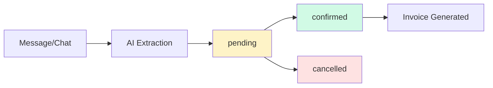

## Overview

Chat2Cash provides a complete order management system with CRUD operations, status tracking, and revenue analytics. Orders are stored per organization (via `orgId`) and support both simple message-based orders and multi-field chat orders.

## Order Lifecycle



### Order States

| Status | Description | Transitions |
|--------|-------------|-------------|
| `pending` | Newly extracted order awaiting confirmation | → `confirmed`, `cancelled` |
| `confirmed` | Business has confirmed the order | → Terminal state |
| `cancelled` | Order rejected or cancelled | → Terminal state |

## Data Models

### ExtractedOrder (Single Message)

Generated by `/api/orders/extract` from a single message.

```typescript
interface ExtractedOrder {
  id: string;                    // UUID
  customerName?: string;
  customerPhone?: string;
  items: OrderItem[];
  totalAmount?: number;
  currency: string;              // "INR"
  notes?: string;
  rawMessage: string;            // Original input
  confidence: number;            // 0.0 - 1.0
  status: "pending" | "confirmed" | "cancelled";
  createdAt: string;             // ISO 8601
}

interface OrderItem {
  name: string;
  quantity: number;
  unit?: string;                 // "kg", "dozen", "pieces"
  pricePerUnit?: number;
  totalPrice?: number;
}
```

### ExtractedChatOrder (Chat Log)

Generated by `/api/orders/extract-chat` from conversation history.

```typescript
interface ExtractedChatOrder {
  id: string;
  customer_name: string | null;
  items: ChatOrderItem[];
  delivery_address: string | null;
  delivery_date: string | null;
  special_instructions: string | null;
  total: number | null;
  confidence: "high" | "medium" | "low";
  status: "pending" | "confirmed" | "cancelled";
  created_at: string;
  raw_messages: ChatMessage[];   // Full conversation
}

interface ChatOrderItem {
  product_name: string;
  quantity: number;
  price: number | null;
}
```

## REST API

### Create Order

<CodeGroup>
```bash Extract from Single Message
curl -X POST https://api.chat2cash.in/api/orders/extract \
  -H "Authorization: Bearer YOUR_API_KEY" \
  -H "Content-Type: application/json" \
  -d '{
    "message": "Hi, I need 5 kg mangoes and 2 dozen bananas"
  }'
```

```bash Extract from Chat
curl -X POST https://api.chat2cash.in/api/orders/extract-chat \
  -H "Authorization: Bearer YOUR_API_KEY" \
  -H "Content-Type: application/json" \
  -d '{
    "messages": [
      { "sender": "customer", "text": "Hi, mujhe mangoes chahiye" },
      { "sender": "business", "text": "How many kg?" },
      { "sender": "customer", "text": "5 kg dedo" }
    ]
  }'
```
</CodeGroup>

*Source: backend/src/controllers/orderController.ts:13-18, 54-59*

### List Orders

```bash
curl https://api.chat2cash.in/api/orders?limit=50&offset=0 \
  -H "Authorization: Bearer YOUR_API_KEY"
```

**Query Parameters:**
- `limit` (default: 50) — Number of orders to return
- `offset` (default: 0) — Pagination offset

**Response:**
```json
[
  {
    "id": "550e8400-e29b-41d4-a716-446655440000",
    "customer_name": "John Doe",
    "items": [
      {
        "product_name": "mangoes",
        "quantity": 5,
        "price": 100
      }
    ],
    "total": 500,
    "status": "confirmed",
    "created_at": "2026-03-04T10:30:00.000Z"
  }
]
```

*Source: backend/src/controllers/orderController.ts:35-41*

### Get Single Order

```bash
curl https://api.chat2cash.in/api/orders/{orderId} \
  -H "Authorization: Bearer YOUR_API_KEY"
```

**Response:**
```json
{
  "id": "550e8400-e29b-41d4-a716-446655440000",
  "customer_name": "John Doe",
  "items": [
    {
      "product_name": "mangoes",
      "quantity": 5,
      "price": 100
    }
  ],
  "delivery_address": "123 Main St, Mumbai",
  "delivery_date": "2026-03-05",
  "special_instructions": "Call before delivery",
  "total": 500,
  "confidence": "high",
  "status": "confirmed",
  "created_at": "2026-03-04T10:30:00.000Z",
  "raw_messages": [
    { "sender": "customer", "text": "Hi, mujhe mangoes chahiye" }
  ]
}
```

*Source: backend/src/controllers/orderController.ts:43-52*

### Update Order Status

```bash
curl -X PATCH https://api.chat2cash.in/api/orders/{orderId}/status \
  -H "Authorization: Bearer YOUR_API_KEY" \
  -H "Content-Type: application/json" \
  -d '{
    "status": "confirmed"
  }'
```

**Allowed values:** `pending`, `confirmed`, `cancelled`

*Source: backend/src/controllers/orderController.ts:61-74*

### Edit Order Details

Update customer info, items, delivery details, or pricing.

```bash
curl -X PUT https://api.chat2cash.in/api/orders/{orderId} \
  -H "Authorization: Bearer YOUR_API_KEY" \
  -H "Content-Type: application/json" \
  -d '{
    "customer_name": "Jane Doe",
    "items": [
      {
        "product_name": "mangoes",
        "quantity": 10,
        "price": 120
      }
    ],
    "delivery_address": "456 New St, Delhi",
    "total": 1200
  }'
```

**Supported fields:**
- `customer_name`
- `items` (full replacement)
- `delivery_address`
- `delivery_date`
- `special_instructions`
- `total`
- `status`

*Source: backend/src/controllers/orderController.ts:76-87*

### Delete Order

```bash
curl -X DELETE https://api.chat2cash.in/api/orders/{orderId} \
  -H "Authorization: Bearer YOUR_API_KEY"
```

**Response:**
```json
{
  "success": true,
  "message": "Order deleted successfully"
}
```

*Source: backend/src/controllers/orderController.ts:89-98*

## Analytics & Statistics

### Get Order Stats

Returns aggregated metrics for your organization.

```bash
curl https://api.chat2cash.in/api/orders/stats \
  -H "Authorization: Bearer YOUR_API_KEY"
```

**Response:**
```json
{
  "total_orders": 142,
  "pending_orders": 23,
  "confirmed_orders": 119,
  "total_revenue": 125000
}
```

**Implementation:**
```typescript
export const getStats = asyncHandler(async (req: Request, res: Response) => {
  const orgId = req.orgId!;
  const totalOrders = await storage.getChatOrdersCount(orgId);
  const pendingOrders = await storage.getChatOrdersCount(orgId, "pending");
  const confirmedOrders = await storage.getChatOrdersCount(orgId, "confirmed");
  const totalRevenue = await storage.getTotalRevenue(orgId);

  res.json({
    total_orders: totalOrders,
    pending_orders: pendingOrders,
    confirmed_orders: confirmedOrders,
    total_revenue: totalRevenue
  });
});
```

*Source: backend/src/controllers/orderController.ts:20-33*

## Customer Linking

### By Phone Number

For single-message orders, `customerPhone` is extracted and can be used to link orders to the same customer.

```typescript
const order: ExtractedOrder = {
  id: randomUUID(),
  customerName: parsed.customerName || undefined,
  customerPhone: parsed.customerPhone || undefined,  // Links orders
  items: [...],
  status: "pending",
  createdAt: new Date().toISOString(),
};
```

*Source: backend/src/services/anthropicService.ts:192-212*

### By Name

For chat orders, `customer_name` is extracted from conversation context.

```typescript
const order: ExtractedChatOrder = {
  id: randomUUID(),
  customer_name: parsed.customer_name || null,  // From chat context
  items: [...],
  status: "pending",
  created_at: new Date().toISOString(),
};
```

*Source: backend/src/services/anthropicService.ts:253-274*

<Note>
  Customer data is stored per organization. Linking logic (e.g., fuzzy matching, phone normalization) should be implemented in your application layer.
</Note>

## Product Tracking

### Item Schema

Each order contains an array of items with product name, quantity, and optional pricing.

**Single Message Orders:**
```typescript
interface OrderItem {
  name: string;           // Product name (e.g., "mangoes")
  quantity: number;       // Quantity ordered
  unit?: string;          // "kg", "dozen", "pieces", "litres"
  pricePerUnit?: number;  // Unit price in INR
  totalPrice?: number;    // Line total (quantity × pricePerUnit)
}
```

**Chat Orders:**
```typescript
interface ChatOrderItem {
  product_name: string;   // Product name
  quantity: number;       // Quantity ordered
  price: number | null;   // Unit price (or total if ambiguous)
}
```

*Source: backend/src/schema (referenced in anthropicService.ts:165-186, 228-247)*

### Building a Product Catalog

You can aggregate `product_name` / `name` fields across orders to build a product catalog:

```sql
SELECT 
  jsonb_array_elements(data->'items')->>'product_name' AS product,
  COUNT(*) AS order_count,
  SUM((jsonb_array_elements(data->'items')->>'quantity')::numeric) AS total_qty
FROM chat_orders
WHERE org_id = 'your-org-id'
GROUP BY product
ORDER BY order_count DESC;
```

<Tip>
  Use product name normalization (lowercase, pluralization handling) to merge variants like "mango" / "mangoes".
</Tip>

## Multi-tenancy

All order operations are scoped to `orgId` via middleware:

```typescript
export const getOrders = asyncHandler(async (req: Request, res: Response) => {
  const limit = Number(req.query.limit) || 50;
  const offset = Number(req.query.offset) || 0;
  
  const orders = await storage.getChatOrders(req.orgId!, limit, offset);
  res.json(orders.map(sanitizeResponse));
});
```

The `req.orgId` is set by authentication middleware based on the API key. This ensures organizations can only access their own orders.

*Source: backend/src/controllers/orderController.ts:35-41*

## Best Practices

<AccordionGroup>
  <Accordion title="Use pagination for large order lists">
    Always set a reasonable `limit` (e.g., 50-100) when fetching orders. Use `offset` for pagination to avoid loading thousands of orders in one request.
  </Accordion>

  <Accordion title="Monitor low-confidence orders">
    Orders with `confidence < 0.7` (or `"low"`) should trigger manual review. Consider adding a dashboard flag for these orders.
  </Accordion>

  <Accordion title="Preserve raw input">
    Both order types store the original input (`rawMessage` or `raw_messages`). Use this for dispute resolution or re-extraction.
  </Accordion>

  <Accordion title="Handle missing prices gracefully">
    Many orders won't include pricing (e.g., "I need 5 kg mangoes"). Your UI should allow staff to add prices before confirming the order.
  </Accordion>

  <Accordion title="Use async extraction for high volume">
    If you're processing 100+ orders/minute, use the async endpoints (`/extract-async`, `/extract-chat-async`) to avoid blocking HTTP workers.
  </Accordion>
</AccordionGroup>

## Error Handling

The order controller uses a centralized error handler:

```typescript
import { asyncHandler, AppError } from "../middlewares/errorHandler";

export const getOrderById = asyncHandler(async (req: Request, res: Response) => {
  const id = req.params.id as string;
  const order = await storage.getChatOrder(req.orgId!, id);
  
  if (!order) {
    throw new AppError("Order not found", 404);
  }
  
  res.json(sanitizeResponse(order));
});
```

**Error Response:**
```json
{
  "error": "Order not found",
  "statusCode": 404
}
```

*Source: backend/src/controllers/orderController.ts:43-52*

## Related Pages

<CardGroup cols={3}>
  <Card title="AI Extraction" icon="brain" href="/features/ai-extraction">
    How orders are extracted from messages
  </Card>
  <Card title="Invoice Generation" icon="file-invoice" href="/features/invoice-generation">
    Generate GST invoices from confirmed orders
  </Card>
  <Card title="Async Processing" icon="gears" href="/features/async-processing">
    Background jobs for order extraction
  </Card>
</CardGroup>