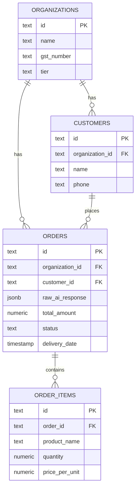
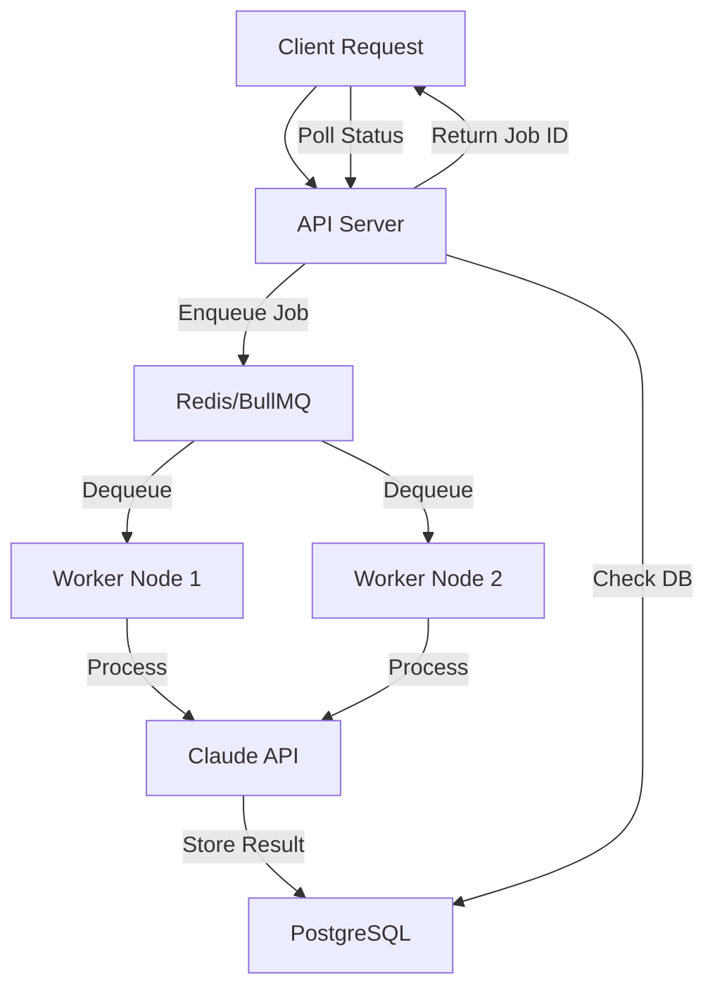

# How It Works

Chat2Cash transforms unstructured WhatsApp conversations into structured orders and invoices through a **three-stage AI-powered workflow**.

## High-Level Workflow


<Steps>
  <Step title="WhatsApp Chat → AI Extraction">
    Customer sends a message in Hindi, English, or Hinglish. You paste it into Chat2Cash.
  </Step>
  
  <Step title="AI Extraction → Structured Order">
    Claude 3.5 Sonnet parses the message and extracts items, quantities, prices, delivery details, and intent.
  </Step>
  
  <Step title="Structured Order → Database">
    The extracted data is validated, normalized, and stored in PostgreSQL with full audit trail.
  </Step>
  
  <Step title="Database → GST Invoice">
    One-click invoice generation with automatic CGST/SGST/IGST calculation and sequential numbering.
  </Step>
</Steps>

## Stage 1: AI Extraction

### Single Message Extraction

When you send a single WhatsApp message to Chat2Cash:

**Input:**
```text
bhai 2 kilo aaloo, 1 kilo pyaaz dena kal shaam tak
```

**API Call:**
```bash
POST /api/extract
Content-Type: application/json

{
  "message": "bhai 2 kilo aaloo, 1 kilo pyaaz dena kal shaam tak"
}
```

**What Happens Behind the Scenes:**

<Tabs>
  <Tab title="1. Request Validation">
    ```typescript
    // Zod schema validation
    const extractOrderRequestSchema = z.object({
      message: z.string().min(1, "Message is required"),
    });
    
    // Input sanitization (prevent injection attacks)
    const sanitized = sanitizeInput(request.body.message);
    ```
    
    - Validates the message is non-empty
    - Sanitizes input to prevent SQL/NoSQL injection
    - Applies rate limiting (max 100 requests/15 min)
  </Tab>
  
  <Tab title="2. Claude API Call">
    ```typescript
    // anthropicService.ts:158
    const systemPrompt = getPrompt("SINGLE_MESSAGE_EXTRACT", "v1");
    
    const response = await anthropic.messages.create({
      model: "claude-3-5-sonnet-20241022",
      max_tokens: 1024,
      system: systemPrompt,
      tools: [{
        name: "record_order",
        input_schema: {
          type: "object",
          properties: {
            customerName: { type: ["string", "null"] },
            items: { type: "array", items: { ... } },
            totalAmount: { type: ["number", "null"] },
            confidence: { type: "number" }
          }
        }
      }],
      messages: [{ role: "user", content: rawMessage }]
    });
    ```
    
    - Uses **Tool Calling** to guarantee structured output
    - Includes Hinglish-specific system prompt
    - Retry logic with exponential backoff (3 retries)
    - Respects Retry-After headers on rate limits
  </Tab>
  
  <Tab title="3. Structured Output">
    ```json
    {
      "id": "550e8400-e29b-41d4-a716-446655440000",
      "customerName": null,
      "items": [
        {
          "name": "Aaloo",
          "quantity": 2,
          "unit": "kg",
          "pricePerUnit": null,
          "totalPrice": null
        },
        {
          "name": "Pyaaz",
          "quantity": 1,
          "unit": "kg",
          "pricePerUnit": null,
          "totalPrice": null
        }
      ],
      "totalAmount": null,
      "notes": "Delivery tomorrow evening",
      "confidence": 0.92,
      "status": "pending",
      "createdAt": "2024-03-15T10:30:00.000Z"
    }
    ```
    
    - **Confidence score**: 0.92 (92% confident)
    - **Notes field**: Captures delivery intent
    - **Status**: Defaults to "pending"
  </Tab>
</Tabs>

### Full Chat Extraction

For multi-message conversations:

**Input:**
```json
POST /api/extract-order
Content-Type: application/json

{
  "messages": [
    { "sender": "Customer", "text": "bhai price kya hai aaloo ka?" },
    { "sender": "You", "text": "20 rupay kilo" },
    { "sender": "Customer", "text": "ok 5 kilo dena" },
    { "sender": "Customer", "text": "aur 2 kilo pyaaz bhi" },
    { "sender": "You", "text": "done, kal delivery?" },
    { "sender": "Customer", "text": "haan shaam ko 6 baje" }
  ]
}
```

**AI Processing:**

<Card title="Sliding Window Algorithm" icon="window" iconType="duotone">
Long chat histories are truncated using a **token-aware sliding window**:

```typescript
// anthropicService.ts:49
function applySlidingWindow(messages: ChatMessage[], maxTokens = 8000) {
  let currentTokens = 0;
  const pruned: ChatMessage[] = [];
  
  // Start from the most recent message and work backward
  for (let i = messages.length - 1; i >= 0; i--) {
    const lineTokens = countTokens(`${messages[i].sender}: ${messages[i].text}`);
    if (currentTokens + lineTokens > maxTokens) break;
    currentTokens += lineTokens;
    pruned.unshift(messages[i]);
  }
  
  return pruned;
}
```

**Why token-based instead of character count?**

Hindi/Devanagari script consumes 2-3 tokens per character (vs. 0.25 for English). A 12,000-character limit can silently exceed Claude's input budget on Hinglish chats.
</Card>

**Extracted Output:**
```json
{
  "id": "...",
  "customer_name": null,
  "items": [
    { "product_name": "Aaloo", "quantity": 5, "price": 20 },
    { "product_name": "Pyaaz", "quantity": 2, "price": null }
  ],
  "delivery_date": "tomorrow",
  "delivery_address": null,
  "special_instructions": "6 PM delivery",
  "total": 100,
  "confidence": "high",
  "status": "pending"
}
```

<Note>
**Context-Aware Intelligence**  
Claude understands that "ok 5 kilo dena" is confirming an order (not an inquiry) because it follows the price discussion. It also captures the delivery time from a separate message.
</Note>

## Stage 2: Structured Storage

### Database Schema

Extracted orders are stored in PostgreSQL with full normalization:



<Tabs>
  <Tab title="Orders Table">
    ```sql
    CREATE TABLE orders (
      id TEXT PRIMARY KEY,
      organization_id TEXT REFERENCES organizations(id),
      customer_id TEXT REFERENCES customers(id),
      extraction_type TEXT NOT NULL, -- 'single' or 'chat'
      raw_ai_response JSONB NOT NULL, -- Original Claude response
      total_amount NUMERIC(12, 2),
      currency TEXT DEFAULT 'INR',
      delivery_date TIMESTAMP,
      delivery_address TEXT,
      special_instructions TEXT,
      raw_messages JSONB NOT NULL, -- Original WhatsApp messages
      confidence TEXT NOT NULL, -- 'high', 'medium', 'low'
      status TEXT DEFAULT 'pending',
      invoice JSONB, -- Generated invoice data
      invoice_sequence INTEGER, -- Sequential invoice number
      deleted_at TIMESTAMP, -- Soft delete
      created_at TIMESTAMP DEFAULT NOW()
    );
    
    -- Indexes for performance
    CREATE INDEX idx_orders_status ON orders(status);
    CREATE INDEX idx_orders_org ON orders(organization_id);
    CREATE INDEX idx_orders_customer ON orders(customer_id);
    CREATE INDEX idx_raw_ai_gin ON orders USING GIN(raw_ai_response);
    ```
  </Tab>
  
  <Tab title="Order Items Table">
    ```sql
    CREATE TABLE order_items (
      id TEXT PRIMARY KEY,
      order_id TEXT REFERENCES orders(id),
      organization_id TEXT REFERENCES organizations(id),
      product_id TEXT REFERENCES products(id), -- Optional link to catalog
      product_name TEXT NOT NULL,
      quantity NUMERIC(12, 3) NOT NULL,
      unit TEXT, -- 'kg', 'piece', 'liter'
      price_per_unit NUMERIC(12, 2),
      total_price NUMERIC(12, 2)
    );
    
    CREATE INDEX idx_order_items_order ON order_items(order_id);
    ```
  </Tab>
  
  <Tab title="Customers Table">
    ```sql
    CREATE TABLE customers (
      id TEXT PRIMARY KEY,
      organization_id TEXT REFERENCES organizations(id),
      name TEXT,
      phone TEXT, -- Encrypted/hashed in production
      created_at TIMESTAMP DEFAULT NOW()
    );
    
    CREATE INDEX idx_customers_org_phone ON customers(organization_id, phone);
    ```
  </Tab>
</Tabs>

### PII Protection

<Warning>
**Automatic Redaction in Logs**  
All phone numbers and customer names are automatically redacted from Pino logs and Sentry error reports:

```typescript
// middlewares/piiRedactor.ts
const PII_PATTERNS = {
  phone: /\b\d{10}\b|\+91[\s-]?\d{10}/g,
  name: /"name"\s*:\s*"([^"]+)"/g,
};

function redact(text: string): string {
  return text
    .replace(PII_PATTERNS.phone, '[REDACTED_PHONE]')
    .replace(PII_PATTERNS.name, '"name": "[REDACTED]"');
}
```
</Warning>

## Stage 3: Invoice Generation

### One-Click PDF Creation

```bash
POST /api/generate-invoice
Content-Type: application/json

{
  "customer_name": "Rajesh Sharma",
  "items": [
    { "product_name": "Aaloo", "quantity": 5, "price": 20 },
    { "product_name": "Pyaaz", "quantity": 2, "price": 30 }
  ],
  "total": 160
}
```

**Invoice Processing:**

<Steps>
  <Step title="Sequential Numbering">
    ```typescript
    // Get next invoice number for this organization
    const lastInvoice = await db.query.ordersTable.findFirst({
      where: eq(ordersTable.organizationId, orgId),
      orderBy: desc(ordersTable.invoiceSequence)
    });
    
    const nextSequence = (lastInvoice?.invoiceSequence || 0) + 1;
    const invoiceNumber = `INV-${nextSequence.toString().padStart(6, '0')}`;
    // Result: INV-000042
    ```
  </Step>
  
  <Step title="GST Calculation">
    ```typescript
    // invoiceService.ts
    const subtotal = items.reduce((sum, item) => 
      sum + (item.quantity * item.price), 0
    );
    
    const taxRate = businessProfile.taxRate || 18; // Default 18%
    const cgst = subtotal * (taxRate / 2 / 100); // 9%
    const sgst = subtotal * (taxRate / 2 / 100); // 9%
    const total = subtotal + cgst + sgst;
    ```
    
    Automatically splits GST into CGST/SGST for intra-state transactions.
  </Step>
  
  <Step title="PDF Generation">
    ```typescript
    // pdfService.ts (using PDFKit)
    const doc = new PDFDocument({ size: 'A4', margin: 50 });
    
    // Header
    doc.fontSize(20).text(businessName, { align: 'center' });
    doc.fontSize(10).text(`GST: ${gstNumber}`);
    
    // Invoice metadata
    doc.text(`Invoice #: ${invoiceNumber}`);
    doc.text(`Date: ${new Date().toLocaleDateString('en-IN')}`);
    doc.text(`Customer: ${customerName}`);
    
    // Line items table
    doc.text('Items:', { underline: true });
    items.forEach(item => {
      doc.text(`${item.product_name} × ${item.quantity} = ₹${item.amount}`);
    });
    
    // GST breakdown
    doc.text(`Subtotal: ₹${subtotal}`);
    doc.text(`CGST (9%): ₹${cgst}`);
    doc.text(`SGST (9%): ₹${sgst}`);
    doc.fontSize(14).text(`Total: ₹${total}`, { bold: true });
    
    doc.end();
    ```
  </Step>
  
  <Step title="Response">
    ```json
    {
      "invoice_number": "INV-000042",
      "date": "2024-03-15",
      "customer_name": "Rajesh Sharma",
      "items": [...],
      "subtotal": 160,
      "cgst": 14.40,
      "sgst": 14.40,
      "total": 188.80,
      "pdf_url": "/api/invoices/INV-000042.pdf"
    }
    ```
  </Step>
</Steps>

## Distributed Architecture

### Why Decouple API and Workers?

<Card title="Problem: Long-Running AI Requests" icon="hourglass" iconType="duotone" color="#FF6D00">
Claude API calls can take 2-8 seconds. If the API server handles extraction synchronously:

- Blocks the event loop
- Poor user experience on high load
- Timeout errors on slow responses
- No retry mechanism on failures
</Card>

**Solution: Background Job Queue**



### Async Extraction Flow

```bash
# 1. Enqueue extraction job
POST /api/async/extract
{
  "message": "2 kilo aaloo chahiye"
}

# Response (immediate)
{
  "jobId": "extraction:1234567890",
  "status": "queued",
  "estimatedTime": "3-5 seconds"
}

# 2. Poll for status
GET /api/jobs/extraction:1234567890

# Response (after 3 seconds)
{
  "jobId": "extraction:1234567890",
  "status": "completed",
  "result": {
    "id": "...",
    "items": [...],
    "confidence": 0.95
  }
}
```

### BullMQ Configuration

```typescript
// queueService.ts
const extractionQueue = new Queue('extraction', {
  connection: redisConnection,
  defaultJobOptions: {
    attempts: 3, // Retry up to 3 times
    backoff: {
      type: 'exponential',
      delay: 2000, // Start with 2 second delay
    },
    removeOnComplete: 100, // Keep last 100 completed jobs
    removeOnFail: 500, // Keep last 500 failed jobs for debugging
  }
});

// Worker processor
const worker = new Worker('extraction', async (job) => {
  const { message } = job.data;
  
  log(`Processing extraction job ${job.id}`, 'worker');
  
  const result = await extractOrderFromMessage(message);
  
  // Store in database
  await storageService.saveOrder(result);
  
  return result;
}, {
  connection: redisConnection,
  concurrency: 5, // Process 5 jobs in parallel
});
```

<Note>
**Redis AOF Persistence Enabled**  
Append-Only File (AOF) persistence ensures zero job loss during crashes. Every job write is logged to disk before Redis acknowledges it.
</Note>

## Observability & Debugging

### Correlation IDs

Every request gets a unique correlation ID that traces across API → Queue → Worker → Database:

```typescript
// middlewares/logger.ts
app.use((req, res, next) => {
  req.correlationId = req.headers['x-correlation-id'] || randomUUID();
  res.setHeader('X-Correlation-ID', req.correlationId);
  next();
});

// All logs include the correlation ID
log(`Extracting order for message`, 'anthropic', { correlationId: req.correlationId });
```

**Example log output:**
```json
{
  "level": "info",
  "time": "2024-03-15T10:30:00.000Z",
  "correlationId": "550e8400-e29b-41d4-a716-446655440000",
  "context": "anthropic",
  "msg": "Claude API responded in 2341ms (usage: 156in/87out)"
}
```

### Sentry Integration

All errors are automatically reported to Sentry with full context:

```typescript
// middlewares/errorHandler.ts
app.use((err, req, res, next) => {
  Sentry.captureException(err, {
    tags: {
      correlationId: req.correlationId,
      endpoint: req.path,
      method: req.method,
    },
    user: {
      id: req.organizationId,
    },
    extra: {
      body: req.body, // PII redacted
      query: req.query,
    },
  });
  
  res.status(500).json({ error: 'Internal server error' });
});
```

---

<CardGroup cols={2}>
  <Card title="API Reference" icon="code" href="/api/overview">
    Explore all endpoints, schemas, and examples
  </Card>
  
  <Card title="Quick Start" icon="rocket" href="/quickstart">
    Extract your first order in 5 minutes
  </Card>
  
  <Card title="Deployment Guide" icon="server" href="/deployment/docker-compose">
    Deploy to production with Docker Compose
  </Card>
  
  <Card title="Architecture Deep Dive" icon="diagram-project" href="/architecture/overview">
    Learn about scaling, security, and observability
  </Card>
</CardGroup>