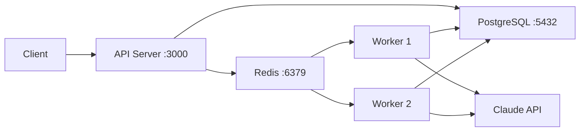

## Overview

Chat2Cash uses a **decoupled architecture** where the API server handles HTTP requests while dedicated worker nodes process AI extraction jobs. Docker Compose orchestrates all services with health checks and persistence.

## Architecture



### Services

| Service | Purpose | Port | Replicas |
|---------|---------|------|----------|
| **db** | PostgreSQL 15 database | 5432 | 1 |
| **redis** | BullMQ queue backend with AOF | 6379 | 1 |
| **api** | Express.js HTTP server | 3000 | 1 |
| **worker** | Background job processor | - | 2 (scalable) |
| **frontend** | Vite dev server | 5173 | 1 |

<Info>
  Worker replicas can be scaled independently: `docker-compose up --scale worker=5`
</Info>

## Installation

<Steps>
  <Step title="Clone the repository">
    ```bash
    git clone https://github.com/yourusername/chat2cash.git
    cd chat2cash
    ```
  </Step>

  <Step title="Configure environment variables">
    Create a `.env` file in the project root:
    
    ```bash .env
    # Required
    ANTHROPIC_API_KEY="sk-ant-api03-..."
    
    # Business defaults (used when no profile exists in DB)
    DEFAULT_BUSINESS_NAME="Chat2Cash Store"
    DEFAULT_GST_NUMBER="22AAAAA0000A1Z5"
    
    # Optional
    SENTRY_DSN="https://your-sentry-dsn@sentry.io/..."
    ```
    
    <Warning>
      The stack will fail to start without `ANTHROPIC_API_KEY`.
    </Warning>
  </Step>

  <Step title="Launch all services">
    Build and start the entire stack:
    
    ```bash
    docker-compose up --build
    ```
    
    For detached mode (runs in background):
    
    ```bash
    docker-compose up -d --build
    ```
    
    View logs:
    
    ```bash
    docker-compose logs -f api
    docker-compose logs -f worker
    ```
  </Step>

  <Step title="Verify health">
    Check that all services are healthy:
    
    ```bash
    docker-compose ps
    ```
    
    Expected output:
    
    ```
    NAME                STATUS              PORTS
    db                  Up (healthy)        0.0.0.0:5432->5432/tcp
    redis               Up (healthy)        0.0.0.0:6379->6379/tcp
    api                 Up                  0.0.0.0:3000->3000/tcp
    worker_1            Up
    worker_2            Up
    frontend            Up                  0.0.0.0:5173->5173/tcp
    ```
    
    Test the API health endpoint:
    
    ```bash
    curl http://localhost:3000/api/health
    ```
    
    Expected response:
    
    ```json
    {
      "status": "healthy",
      "timestamp": "2026-03-04T18:30:00Z",
      "services": {
        "database": "connected",
        "redis": "connected",
        "ai": "ready"
      }
    }
    ```
  </Step>
</Steps>

## Service Configuration

### PostgreSQL Database

The database service uses persistent volumes to retain data across restarts.

```yaml docker-compose.yml
db:
  image: postgres:15-alpine
  environment:
    POSTGRES_USER: user
    POSTGRES_PASSWORD: password
    POSTGRES_DB: chat2cash
  volumes:
    - postgres_data:/var/lib/postgresql/data
  healthcheck:
    test: ["CMD-SHELL", "pg_isready -U user -d chat2cash"]
    interval: 10s
    timeout: 5s
    retries: 5
```

**Connection string:** `postgres://user:password@db:5432/chat2cash`

<Warning>
  Change the default password in production deployments.
</Warning>

### Redis Queue Backend

Redis runs with **AOF (Append-Only File) persistence** to prevent job loss during crashes.

```yaml docker-compose.yml
redis:
  image: redis:7-alpine
  command: redis-server --appendonly yes --appendfsync everysec
  volumes:
    - redis_data:/data
  healthcheck:
    test: ["CMD", "redis-cli", "ping"]
    interval: 10s
```

**Persistence mode:**
- `--appendonly yes` - Enable AOF
- `--appendfsync everysec` - Sync to disk every second (balance between performance and durability)

### API Server

The API server handles HTTP requests and enqueues jobs for workers.

```yaml docker-compose.yml
api:
  build:
    context: .
    dockerfile: backend/Dockerfile
  command: npm run dev
  environment:
    NODE_ENV: development
    PORT: 3000
    DATABASE_URL: postgres://user:password@db:5432/chat2cash
    REDIS_URL: redis://redis:6379
    ANTHROPIC_API_KEY: ${ANTHROPIC_API_KEY}
  depends_on:
    db:
      condition: service_healthy
    redis:
      condition: service_healthy
```

**Auto-restart:** The API server automatically restarts if it crashes.

### Worker Nodes

Workers process AI extraction jobs from the Redis queue.

```yaml docker-compose.yml
worker:
  build:
    context: .
    dockerfile: backend/Dockerfile
  command: npm run dev:worker
  environment:
    NODE_ENV: development
    DATABASE_URL: postgres://user:password@db:5432/chat2cash
    REDIS_URL: redis://redis:6379
    ANTHROPIC_API_KEY: ${ANTHROPIC_API_KEY}
  deploy:
    replicas: 2  # Run 2 workers by default
```

**Scaling workers:**

```bash
# Scale to 5 workers
docker-compose up --scale worker=5 -d

# Scale down to 1 worker
docker-compose up --scale worker=1 -d
```

## Data Persistence

Docker Compose creates two persistent volumes:

```yaml
volumes:
  postgres_data:  # Database files
  redis_data:     # AOF file for Redis
```

These volumes persist across container restarts and rebuilds.

### Backup volumes

```bash
# Backup PostgreSQL data
docker run --rm \
  -v chat2cash_postgres_data:/data \
  -v $(pwd):/backup \
  alpine tar czf /backup/postgres_backup.tar.gz -C /data .

# Backup Redis AOF
docker run --rm \
  -v chat2cash_redis_data:/data \
  -v $(pwd):/backup \
  alpine tar czf /backup/redis_backup.tar.gz -C /data .
```

### Reset all data

```bash
# Stop services and remove volumes
docker-compose down -v

# Rebuild and start fresh
docker-compose up --build
```

<Warning>
  The `-v` flag **permanently deletes all data**. Backup first if needed.
</Warning>

## Production Deployment

For production environments, modify `docker-compose.yml`:

<Steps>
  <Step title="Use production images">
    ```yaml
    api:
      command: npm start  # Use compiled JavaScript
      environment:
        NODE_ENV: production
    
    worker:
      command: npm run start:worker
      environment:
        NODE_ENV: production
    ```
  </Step>

  <Step title="Enable SSL for PostgreSQL">
    ```yaml
    api:
      environment:
        DATABASE_CA_CERT: ${DATABASE_CA_CERT}
    ```
  </Step>

  <Step title="Secure Redis with password">
    ```yaml
    redis:
      command: redis-server --requirepass ${REDIS_PASSWORD} --appendonly yes
    
    api:
      environment:
        REDIS_URL: redis://:${REDIS_PASSWORD}@redis:6379
    ```
  </Step>

  <Step title="Configure resource limits">
    ```yaml
    worker:
      deploy:
        replicas: 5
        resources:
          limits:
            cpus: '2'
            memory: 2G
          reservations:
            cpus: '0.5'
            memory: 512M
    ```
  </Step>
</Steps>

## Troubleshooting

### Workers not processing jobs

```bash
# Check worker logs
docker-compose logs worker

# Verify Redis connection
docker exec -it chat2cash-redis-1 redis-cli ping
```

### Database connection errors

```bash
# Check if PostgreSQL is ready
docker-compose exec db pg_isready -U user -d chat2cash

# View database logs
docker-compose logs db
```

### API server crashes

```bash
# View recent API logs
docker-compose logs --tail=100 api

# Check environment variables
docker-compose exec api env | grep ANTHROPIC
```

### Ports already in use

If ports 3000, 5432, or 6379 are already taken:

```yaml docker-compose.yml
services:
  api:
    ports:
      - "3001:3000"  # Map to different host port
  
  db:
    ports:
      - "5433:5432"
  
  redis:
    ports:
      - "6380:6379"
```

Update connection strings accordingly.

## Next Steps

<CardGroup cols={2}>
  <Card title="Configuration" icon="gear" href="/configuration">
    Configure business profiles and API keys
  </Card>
  
  <Card title="API Reference" icon="code" href="/api/endpoints/extract">
    Explore the REST API endpoints
  </Card>
  
  <Card title="Manual Setup" icon="hammer" href="/installation/manual">
    Set up a local development environment
  </Card>
</CardGroup>