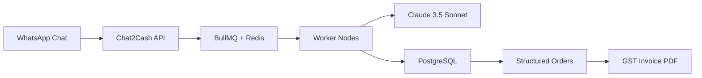

# Welcome to Chat2Cash

Chat2Cash is an **AI operations layer for WhatsApp-first businesses** in India. It automatically reads messy "Hinglish" conversations, extracts structured order details, and generates GST-compliant invoices in seconds—eliminating revenue leakage and manual data entry.

<Note>
**Build India Hackathon Winner (1st Place)**  
Organized by Anthropic × Replit × Lightspeed
</Note>

## The Problem

**60 million SMBs in India run their businesses on WhatsApp.** But WhatsApp is a chat app, not an operating system.

Every day, business owners face:

- **10-15% revenue loss** from orders buried in chat threads
- **Forgotten follow-ups** and missed payment reminders
- **Manual Excel entry at 11 PM** as the only "solution"
- **No audit trail** for tax compliance
- **Language barriers** with traditional ERP systems designed for English

<Card title="Real Impact" icon="chart-line" iconType="duotone">
A typical kirana store owner loses 15+ orders per week simply because they scroll past them in a 200-message WhatsApp thread. That's ₹40,000-60,000 in lost annual revenue.
</Card>

## The Solution

Chat2Cash sits on top of your existing WhatsApp workflow and automatically:

1. **Reads** mixed-language (Hinglish) order messages
2. **Extracts** items, quantities, prices, delivery details, and special instructions
3. **Structures** the data into actionable orders
4. **Generates** GST-compliant PDF invoices with one click
5. **Tracks** order status from pending to fulfilled

No app downloads for customers. No complex training. No workflow changes.

## Key Capabilities

### Advanced AI Extraction (Claude 3.5 Sonnet)

<CardGroup cols={2}>
  <Card title="Hinglish Mastery" icon="language">
    Understands "2 kilo aaloo", "bhaiya red wala dikhao", and mixed-language intents without training.
  </Card>
  
  <Card title="Context Aware" icon="brain">
    Distinguishes between inquiries ("price kya hai?") and confirmed orders ("book kar do").
  </Card>
  
  <Card title="Smart Parsing" icon="wand-magic-sparkles">
    Extracts items, quantities, units, delivery dates, and special instructions from unstructured text.
  </Card>
  
  <Card title="Confidence Scoring" icon="gauge-high">
    Returns confidence levels (high/medium/low) so you know when to review manually.
  </Card>
</CardGroup>

### Enterprise-Grade Architecture



- **Decoupled API & Worker Tiers**: Horizontally scalable with independent processing nodes
- **Robust Queueing**: BullMQ + Redis with AOF persistence for zero job loss
- **Type-Safe Data**: PostgreSQL + Drizzle ORM for normalized storage
- **Multi-Queue System**: Dedicated processors for extraction jobs and webhook deliveries

### Security & Compliance

<Warning>
**PII Protection Built-In**  
Customer names and phone numbers are automatically redacted in logs and monitoring systems. All data is encrypted at rest.
</Warning>

- **Tracing & Error Tracking**: Integrated Sentry with correlation IDs across API and worker boundaries
- **Structured Logging**: Pino logger with auto-generated request tracing
- **Security Headers**: Helmet middleware, input sanitization, strict rate limiting
- **GST Compliance**: Automatic CGST/SGST/IGST calculation and sequential invoice numbering

### Instant Invoicing

```typescript
// Generate an invoice from any order
POST /api/generate-invoice
{
  "customer_name": "Rajesh Sharma",
  "items": [
    { "product_name": "Aaloo", "quantity": 2, "price": 20 },
    { "product_name": "Pyaaz", "quantity": 1, "price": 30 }
  ],
  "total": 70
}
```

Receive a professional PDF invoice with:
- Your business name and GST number
- Sequential invoice numbering
- Itemized breakdown with CGST/SGST/IGST
- Customer details
- Payment terms and notes

## Tech Stack

<CardGroup cols={3}>
  <Card title="Runtime" icon="node">
    Node.js + TypeScript
  </Card>
  
  <Card title="Framework" icon="server">
    Express.js
  </Card>
  
  <Card title="Database" icon="database">
    PostgreSQL + Drizzle ORM
  </Card>
  
  <Card title="Queue" icon="layer-group">
    Redis + BullMQ
  </Card>
  
  <Card title="AI Engine" icon="brain-circuit">
    Anthropic Claude 3.5 Sonnet
  </Card>
  
  <Card title="Observability" icon="magnifying-glass-chart">
    Sentry + Pino
  </Card>
</CardGroup>

## Who Is This For?

<Tabs>
  <Tab title="Kirana Store Owners">
    Stop losing orders in WhatsApp threads. Get automatic order extraction and invoicing for groceries, provisions, and daily essentials.
  </Tab>
  
  <Tab title="Wholesale Traders">
    Handle bulk orders from multiple retailers with automatic parsing of complex order messages and inventory tracking.
  </Tab>
  
  <Tab title="Tiffin Services">
    Track daily meal orders with delivery dates, special dietary instructions, and recurring customer management.
  </Tab>
  
  <Tab title="Saree & Clothing Shops">
    Extract product names, quantities, colors, and sizes from conversational order messages.
  </Tab>
  
  <Tab title="Developers">
    Build WhatsApp commerce experiences with RESTful APIs, webhooks, and comprehensive documentation.
  </Tab>
</Tabs>

## Quick Start

Get started in under 5 minutes:

<Steps>
  <Step title="Install with Docker">
    ```bash
    git clone https://github.com/yourusername/chat2cash.git
    cd chat2cash
    ```
  </Step>
  
  <Step title="Configure Environment">
    Create a `.env` file:
    ```bash
    ANTHROPIC_API_KEY="sk-ant-api03-..."
    DEFAULT_BUSINESS_NAME="My Saree Shop"
    DEFAULT_GST_NUMBER="22AAAAA0000A1Z5"
    ```
  </Step>
  
  <Step title="Launch the Stack">
    ```bash
    docker-compose up --build
    ```
  </Step>
  
  <Step title="Extract Your First Order">
    ```bash
    curl -X POST http://localhost:3000/api/extract \
      -H "Content-Type: application/json" \
      -d '{"message": "bhai 2 kilo aaloo, 1 kilo pyaaz dena"}'
    ```
  </Step>
</Steps>

## What's Next?

<CardGroup cols={2}>
  <Card title="Why Chat2Cash?" icon="question" href="/why-chat2cash">
    Understand the revenue impact and personal story behind the product.
  </Card>
  
  <Card title="How It Works" icon="gears" href="/how-it-works">
    Deep dive into the AI extraction workflow and architecture.
  </Card>
  
  <Card title="API Reference" icon="code" href="/api/overview">
    Explore all endpoints, request/response schemas, and examples.
  </Card>
  
  <Card title="Quick Start Guide" icon="rocket" href="/quickstart">
    Get your first order extracted in 5 minutes.
  </Card>
</CardGroup>

---

<Note>
**Built with ❤️ for the 60 million SMBs of India**  
Chat2Cash is open source and actively maintained. Contributions welcome!
</Note>