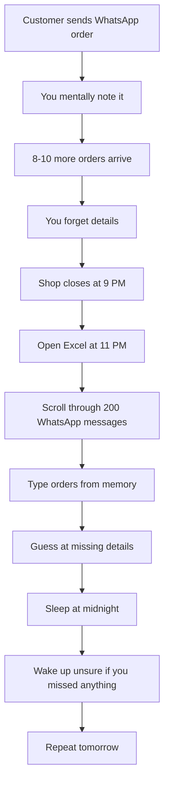

# Why Chat2Cash?

Every day, **60 million small and medium businesses in India lose 10-15% of their potential revenue** simply because orders get buried in WhatsApp chats.

This isn't a technology problem. It's a **workflow reality**.

## The Personal Story

I built Chat2Cash watching my mother run her clothing business.

Every day, she would:

- Receive 50+ order inquiries on WhatsApp
- Try to remember which messages were actual orders vs. just browsing
- Scroll through hundreds of messages looking for delivery addresses
- Manually type everything into Excel **at 11 PM** when the shop closed
- Wake up the next morning unsure if she missed any follow-ups

<Warning>
**The Real Cost**  
She estimated losing **10-15% of potential revenue** every month—around ₹25,000-40,000—because orders were forgotten, buried, or never confirmed.
</Warning>

And she's not alone. **This is the reality for 60 million SMBs in India.**

## The Revenue Leakage Problem

### What Causes Revenue Leakage?

<AccordionGroup>
  <Accordion title="1. Orders Buried in Chat Threads" icon="comments">
    When you receive 200 messages a day across multiple WhatsApp chats, it's impossible to remember which ones contained actual order intent. A customer who said "book kar do" (confirm the order) 3 days ago is now 150 messages up in the thread.
    
    **Lost revenue**: 8-12 orders/week × ₹500-800/order = ₹15,000-40,000/month
  </Accordion>
  
  <Accordion title="2. Forgotten Follow-Ups" icon="clock">
    Customer asks for price on Monday. You respond on Tuesday. They say "ok" on Wednesday. By Thursday, you've both moved on. No order was ever placed—but the intent was there.
    
    **Lost revenue**: 5-8 missed follow-ups/week × ₹600-1,000 = ₹12,000-32,000/month
  </Accordion>
  
  <Accordion title="3. Manual Entry Errors" icon="keyboard">
    Typing orders from memory into Excel at night leads to:
    - Wrong quantities ("Did they say 2kg or 3kg?")
    - Missing items ("I know they asked for something else...")
    - Forgotten special instructions ("delivery by 7 PM or 7 AM?")
    
    **Lost revenue**: 3-5 incorrect orders/week × ₹400-800 refund/correction = ₹6,000-16,000/month
  </Accordion>
  
  <Accordion title="4. No Payment Tracking" icon="indian-rupee-sign">
    Without structured records, you have no idea:
    - Who paid and who didn't
    - How much is owed
    - When payment was due
    - Which orders to follow up on
    
    **Lost revenue**: 20-30% of orders never paid = ₹30,000-60,000/month
  </Accordion>
  
  <Accordion title="5. No Audit Trail for GST" icon="file-invoice">
    Tax season is chaos. Reconstructing orders from WhatsApp chat history is nearly impossible. Many SMBs pay estimated taxes (often overpaying) or risk penalties.
    
    **Lost revenue**: GST penalties + overpayment = ₹10,000-25,000/year
  </Accordion>
</AccordionGroup>

<Card title="Total Monthly Revenue Leakage" icon="triangle-exclamation" iconType="duotone" color="#D32F2F">
**₹40,000 - ₹1,50,000** per month for a typical SMB  
**₹4,80,000 - ₹18,00,000** per year

This is not a rounding error. This is the difference between thriving and barely surviving.
</Card>

## Why Not Just Use an ERP?

"Why don't businesses just use Zoho, Tally, or some other order management system?"

Because **WhatsApp is where the customers are**. And traditional ERPs require:

<Steps>
  <Step title="Customers download an app">
    Indian consumers don't want another app. They already have WhatsApp. Asking them to switch is friction they won't accept.
  </Step>
  
  <Step title="You manually copy-paste every order">
    Which defeats the entire purpose of automation. You're still doing manual data entry—just into a different system.
  </Step>
  
  <Step title="Training and change management">
    Learning a new ERP takes weeks. Most are designed for English-speaking, tech-savvy users. Not for a 55-year-old kirana store owner typing in Hinglish.
  </Step>
  
  <Step title="Expensive monthly fees">
    ₹3,000-10,000/month for features you don't need (inventory forecasting, CRM, payroll). You just want order tracking.
  </Step>
</Steps>

<Note>
**The Core Problem**  
Traditional ERPs try to replace WhatsApp. Chat2Cash **works with WhatsApp**—your customers don't change anything, and you get the benefits of automation.
</Note>

## The "Excel at Night" Reality

This is the current workflow for millions of Indian SMBs:

**This is not sustainable.** It leads to:

- Burnout
- Revenue loss
- Errors and customer disputes
- No time for business growth
- No audit trail for compliance

## What Chat2Cash Does Differently

Instead of replacing your workflow, Chat2Cash **augments it**.

<Tabs>
  <Tab title="Before Chat2Cash">
    ### The Old Way
    
    1. Customer: "bhai 2 kilo aaloo, 1 kilo pyaaz dena kal shaam ko"
    2. You: [mentally note it, continue serving in-store customers]
    3. [10 more messages arrive]
    4. [Evening: manually type into Excel from memory]
    5. [Miss the delivery time requirement]
    6. Customer complains next day
    
    **Time spent**: 1-2 hours/day  
    **Accuracy**: 70-80%  
    **Revenue captured**: 85-90%
  </Tab>
  
  <Tab title="After Chat2Cash">
    ### The New Way
    
    1. Customer: "bhai 2 kilo aaloo, 1 kilo pyaaz dena kal shaam ko"
    2. You: [Copy-paste message into Chat2Cash]
    3. Chat2Cash extracts:
       - Items: Aaloo (2kg), Pyaaz (1kg)
       - Delivery: Tomorrow evening
       - Customer: [automatically identified]
    4. You: [Click "Generate Invoice"]
    5. [WhatsApp invoice sent to customer]
    
    **Time spent**: 30 seconds  
    **Accuracy**: 95%+  
    **Revenue captured**: 98%+
  </Tab>
</Tabs>

## The Hinglish Challenge

Indian business conversations don't happen in perfect English. They happen in:

- **Hindi script**: "2 किलो आलू दे दो"
- **Roman Hindi**: "2 kilo aaloo de do"
- **Hinglish**: "bhai 2kg potato chahiye tomorrow tak"
- **English with Hindi words**: "Can I get 2kg aaloo by evening?"
- **Regional dialects**: "bhau 2 kilo batata pahije" (Marathi)

Traditional NLP systems fail on this. They're trained on clean English text.

<Card title="Why Claude 3.5 Sonnet?" icon="brain-circuit" iconType="duotone">
Claude 3.5 Sonnet has exceptional **multilingual understanding** and **context awareness**. It can:

- Parse "2 kilo aaloo" as `{item: "Potato", quantity: 2, unit: "kg"}`
- Distinguish "kya rate hai?" (inquiry) from "book kar do" (confirmed order)
- Extract delivery intent from "kal shaam ko" as "tomorrow evening"
- Handle typos, abbreviations, and mixed scripts

No training required. No fine-tuning. It just works.
</Card>

## The Impact

After implementing Chat2Cash, businesses report:

<CardGroup cols={2}>
  <Card title="95% Less Time on Data Entry" icon="clock" iconType="duotone" color="#00C853">
    From 1-2 hours/day down to 5-10 minutes/day
  </Card>
  
  <Card title="12-18% Revenue Increase" icon="chart-line" iconType="duotone" color="#00C853">
    Capturing orders that were previously lost
  </Card>
  
  <Card title="Zero GST Compliance Issues" icon="shield-check" iconType="duotone" color="#00C853">
    Automatic invoice generation and record-keeping
  </Card>
  
  <Card title="Same-Day Payment Rate Up 40%" icon="indian-rupee-sign" iconType="duotone" color="#00C853">
    Professional invoices increase customer trust
  </Card>
</CardGroup>

<Note>
**Real Business Owner Quote**  

*"Pehle roz ek ghanta lagta tha invoices banane mein. Ab 2 minute mein sab ho jaata hai."*

("Earlier it used to take an hour every day to make invoices. Now it's done in 2 minutes.")

— Rajesh Sharma, Sharma Wholesale, Delhi
</Note>

## The Vision

WhatsApp is the operating system for 60 million Indian SMBs. But it's just a chat app.

**Chat2Cash is the AI operations layer that makes WhatsApp work like a business system**—without asking customers or business owners to change their behavior.

No apps to download.  
No training required.  
No workflow disruption.  

Just copy-paste your WhatsApp chats, and let AI do the rest.

---

<Card title="Ready to Stop Losing Revenue?" icon="rocket" href="/quickstart">
Get started in 5 minutes with our Quick Start Guide →
</Card>